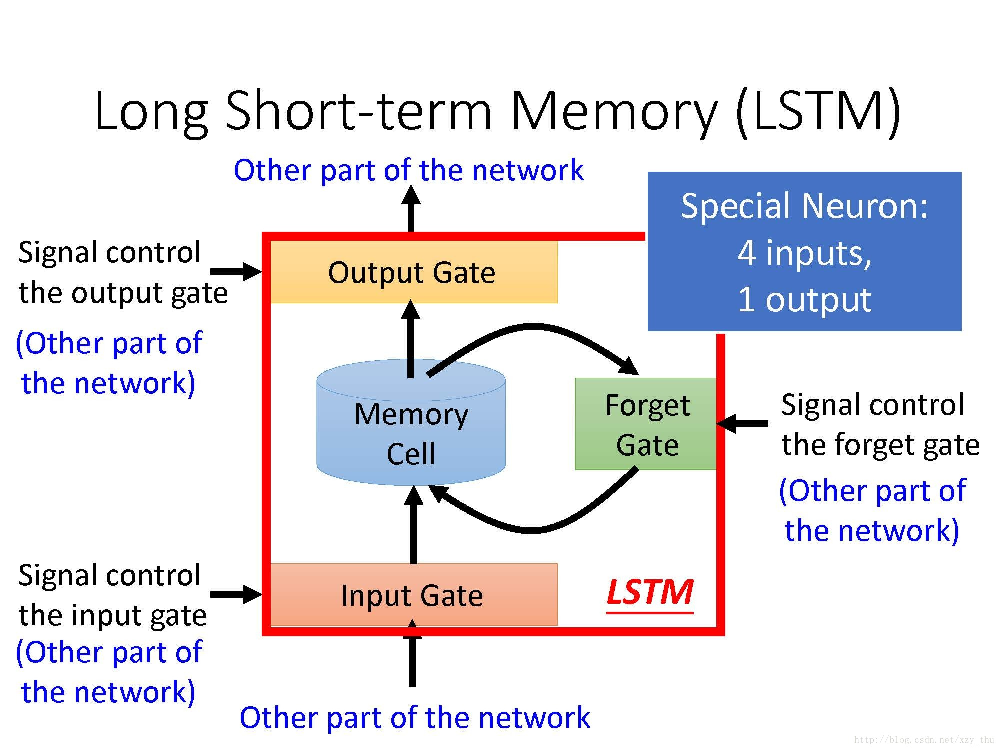

# LSTM

长短期记忆（Long Short-Term Memory）

* 特殊的RNN，为了解决长序列训练过程中的梯度消失和梯度爆炸问题

  

1. input gate打开时，memory gate才可以被写入
2. forget gate对上一个传进来的输入进行**选择性**忘记 （打开时，不forget，memory的值相当于被‘存’起来）
3. output gate打开时，才可以输出
